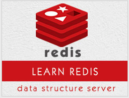

```
Roberto Nogueira  
BSd EE, MSd CE
Solution Integrator Experienced - Certified by Ericsson
```
# TutorialsPoint project



**About**

Learn everything you need to about the subject of this `Tutorialspoint` project.

[Homepage](https://www.tutorialspoint.com/redis/index.htm)

## Topics
```
Redis Basics
[x] Home
[x] Overview
[x] Environment
[x] Configuration
[ ] Data types
Redis Commands
[ ] Commands
[ ] Keys
[ ] Strings
[ ] Hashes
[ ] Lists
[ ] Sets
[ ] Sorted Sets
[ ] HyperLogLog
[ ] Pub/Sub
[ ] Transactions
[ ] Scripting
[ ] Connection
[ ] Server
Redis Advanced
[ ] Backup
[ ] Security
[ ] Benchmarks
[ ] Client Connection
[ ] Pipelining
[ ] Partitioning
[ ] Java
[ ] Php
Redis Useful Resources
[ ] Quick Guide
[ ] Useful Resources
[ ] Discussion
Selected Reading
[ ] Developer's Best Practices
[ ] Questions and Answers
[ ] Effective Resume Writing
[ ] HR Interview Questions
[ ] Computer Glossary
[ ] Who is Who
```
